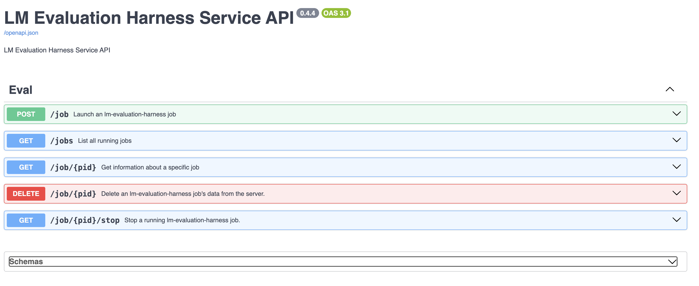

# LM-Evaluation-Harness Server
REST server for running [lm-evaluation-harness](https://github.com/EleutherAI/lm-evaluation-harness/blob/main/lm_eval/__main__.py) evaluations as subprocess'd jobs. A maximum number of 
concurrent job execution slots is is configurable, and jobs will be queued while waiting for an available execution slot. 

## Launch
```bash
uv run uvicorn src.main:app --host 0.0.0.0 --port 8080
```
or
```bash
docker run -p 8080:8080 quay.io/trustyai/lm-eval-server:latest
```
```bash
podman run -p 8080:8080 quay.io/trustyai/lm-eval-server:latest
```

## Launch Enviornment Variables
* `MAX_CONCURRENCY`: How many jobs can be run in parallel (default=4)
* `QUEUE_PROCESS_INTERVAL`: The time interval (in seconds) that governs how often to check if new jobs can be executed from the job queue (default=15).

e.g.:
```bash
MAX_CONCURRENCY=4 QUEUE_PROCESS_INTERVAL=15 uv run uvicorn src.main:app --host 0.0.0.0 --port 8080
```

## Usage
### Start an lm-evaluation-harness job:
```bash
curl localhost:8080/job -H "Content-Type: application/json" -d @example.json
```
Returns:
```json
{"status":"success","message":"Job 1 successfully queued.","job_id":1}
```

The API for requesting an lm-evaluation-harness job is automatically derived from the lm-eval CLI arguments:
```json
{
  "model": "hf",
  "tasks": "string",
  "model_args": "",
  "num_fewshot": 0,
  "batch_size": "1",
  "max_batch_size": 0,
  "device": "string",
  "output_path": "string",
  "limit": 0,
  "use_cache": "string",
  "cache_requests": "string",
  "check_integrity": false,
  "write_out": false,
  "log_samples": false,
  "system_instruction": "string",
  "apply_chat_template": false,
  "fewshot_as_multiturn": false,
  "show_config": false,
  "include_path": "string",
  "gen_kwargs": "string",
  "verbosity": "INFO",
  "wandb_args": "",
  "hf_hub_log_args": "",
  "predict_only": false,
  "seed": "0,1234,1234,1234",
  "trust_remote_code": false,
}
```
There are also two optional arguments to configure the lm-eval-server and the job environment:
* `env_vars`: A dictionary of environment variables for the job environment. This is useful to pass arguments to evaluation tasks.
* `lm_eval_path`: The path to the lm-eval executable binary, if you want to use one that is different than the one bundled inside the server.


See [example.json](example.json) for an example of how to run an MMLU job against a Phi-3 model hosted on localhost.

### List all jobs
```bash
curl "localhost:8080/jobs" | jq
```

Returns:
```json
{
  "jobs": [
    {
      "job_id": 1,
      "argument": "lm-eval-server/.venv/bin/python3 -m lm_eval --model_args model=phi3,base_url=http://localhost:8081/v1/completions,num_concurrent=1,max_retries=3,tokenized_requests=False,tokenizer=microsoft/Phi-3-mini-4k-instruct --limit 1.0 --model local-completions --tasks mmlu",
      "status": "Running",
      "timestamp": "2025-04-07T11:03:51.346281+00:00",
      "exit_code": null,
      "inference_progress_pct": 7
    },
    {
      "job_pid": 2,
      "argument": "lm-eval-server/.venv/bin/python3 -m lm_eval --model_args model=phi3,base_url=http://localhost:8081/v1/completions,num_concurrent=1,max_retries=3,tokenized_requests=False,tokenizer=microsoft/Phi-3-mini-4k-instruct --limit 1.0 --model local-completions --tasks mmlu",
      "status": "Completed",
      "timestamp": "2025-04-07T12:01:15.143251+00:00",
      "exit_code": 0,
      "inference_progress_pct": 100
    }
  ]
}
```
### List all *running* jobs
```bash
curl "localhost:8080/jobs?include_completed=False" | jq
```
Returns:
```json
{
  "jobs": [
    {
      "pid": 1,
      "argument": "lm-eval-server/.venv/bin/python3 -m lm_eval --model_args model=phi3,base_url=http://localhost:8081/v1/completions,num_concurrent=1,max_retries=3,tokenized_requests=False,tokenizer=microsoft/Phi-3-mini-4k-instruct --limit 1.0 --model local-completions --tasks mmlu",
      "status": "Running",
      "timestamp": "2025-04-07T11:03:51.346281+00:00",
      "exit_code": null,
      "inference_progress_pct": 7
    }
  ]
}
```


### Query a running lm-evaluation-harness job:
```bash
curl localhost:8080/job/$JOB_ID
```
Returns:
```json
{
  "job_id": 1,
  "argument": "lm-eval-server/.venv/bin/python3 -m lm_eval --model_args model=phi3,base_url=http://localhost:8081/v1/completions,num_concurrent=1,max_retries=3,tokenized_requests=False,tokenizer=microsoft/Phi-3-mini-4k-instruct --limit 1.0 --model local-completions --tasks mmlu",
  "status": "Running",
  "timestamp": "2025-04-07T11:03:51.346281+00:00",
  "exit_code": null,
  "inference_progress_pct": 37,
  "stdout": [],
  "stderr": [
    "2025-04-03:16:37:49,093 INFO     [__main__.py:279] Verbosity set to INFO\n",
    "2025-04-03:16:37:49,136 INFO     [__init__.py:491] `group` and `group_alias` keys in TaskConfigs are deprecated and will be removed in v0.4.5 of lm_eval. The new `tag` field will be used to allow for a shortcut to a group of tasks one does not wish to aggregate metrics across. `group`s which aggregate across subtasks must be only defined in a separate group config file, which will be the official way to create groups that support cross-task aggregation as in `mmlu`. Please see the v0.4.4 patch notes and our documentation: https://github.com/EleutherAI/lm-evaluation-harness/blob/main/docs/new_task_guide.md#advanced-group-configs for more information.\n",
    "2025-04-03:16:37:52,929 WARNING  [__main__.py:312]  --limit SHOULD ONLY BE USED FOR TESTING.REAL METRICS SHOULD NOT BE COMPUTED USING LIMIT.\n",
    "2025-04-03:16:37:52,929 INFO     [__main__.py:376] Selected Tasks: ['mmlu']\n",
    "2025-04-03:16:37:52,932 INFO     [evaluator.py:161] Setting random seed to 0 | Setting numpy seed to 1234 | Setting torch manual seed to 1234\n",
    "2025-04-03:16:37:52,932 INFO     [evaluator.py:198] Initializing local-completions model, with arguments: {'model': 'phi3', 'base_url': 'http:
    ...
    "Requesting API:  37%|███▋      | 84/228 [00:39<01:05,  2.21it/s]"
    }
```

### Stop a running lm-evaluation-harness job:
```bash
curl "localhost:8080/job/$JOB_ID/stop" | jq
```

### Delete data for an lm-evaluation-harness job:
This deletes all data about the job from /job listing endpoint, and also stops the job if it is still running.
```bash
curl -x DELETE "localhost:8080/job/$JOB_ID" | jq
```

### Stop all running lm-evaluation-harness job:
```bash
curl "localhost:8080/jobs/stop" | jq
```

### Delete data for all lm-evaluation-harness jobs:
```bash
curl -x DELETE "localhost:8080/jobs" | jq
```

### See OpenAPI
Hosted at `localhost:8080/docs`:

